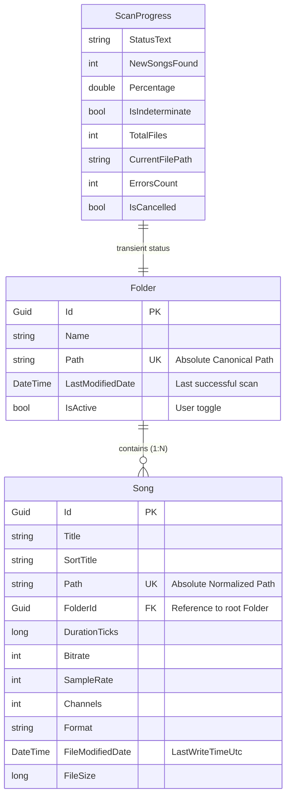
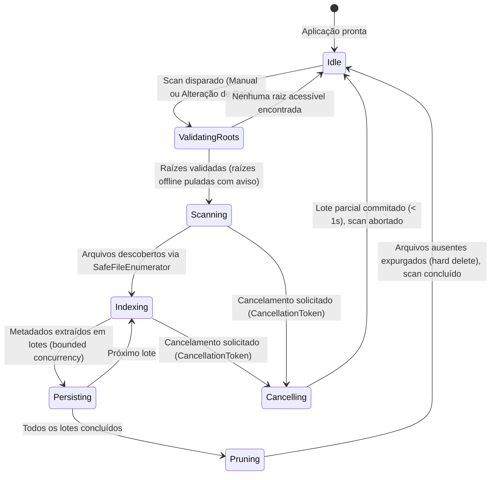

# Data Model: Feature 001 — Recursive Root Library Hardening

**Branch**: `001-recursive-root-library` | **Feature**: [spec.md](spec.md)  
**Date**: 2026-09-20  
**Status**: Completed  

---

## 1. Mapeamento de Entidades Existentes

Conforme o princípio constitucional de não duplicar abstrações, a Feature 001 reutiliza diretamente as entidades existentes no `Resonance.Core.Models` e `Resonance.Core.Data.MusicDbContext`.

---

## 2. Detalhamento das Entidades

### 2.1. `Folder` (Entidade de Persistência / Raiz de Biblioteca)

* **Classe**: `Resonance.Core.Models.Folder`
* **Finalidade**: Armazena as pastas raiz configuradas pelo usuário para varredura recursiva.
* **Propriedades**:
  | Campo | Tipo | Nulo | Descrição / Regra de Invariante |
  |---|---|---|---|
  | `Id` | `Guid` | Não | Chave primária única. |
  | `Name` | `string` | Não | Nome de exibição da pasta (ex.: nome do diretório ou rótulo amigável). |
  | `Path` | `string` | Não | Caminho canônico absoluto normalizado (`PathCanonicalizer.Normalize`). Deve ser único. |
  | `LastModifiedDate` | `DateTime?` | Sim | Timestamp UTC do término da última varredura bem-sucedida. |
  | `IsActive` | `bool` | Não | Flag que determina se a pasta é incluída no scan global da biblioteca. |
* **Regras de Negócio & Invariantes**:
  - Não pode existir duplicidade de caminho canônico (`Path` é índice único no SQLite).
  - Raízes não podem se sobrepor: nenhuma pasta pode ser ancestral ou descendente de outra pasta raiz ativa.

---

### 2.2. `Song` (Entidade de Persistência / Faixa de Áudio Indexada)

* **Classe**: `Resonance.Core.Models.Song`
* **Finalidade**: Representa o arquivo de áudio indexado a partir de uma pasta raiz ou de suas subpastas em qualquer nível de profundidade.
* **Propriedades Relevantes para a Feature 001**:
  | Campo | Tipo | Nulo | Descrição / Regra de Invariante |
  |---|---|---|---|
  | `Id` | `Guid` | Não | Chave primária única da faixa. |
  | `Title` | `string` | Não | Título da música (extraído de tags ou nome do arquivo como fallback). |
  | `Path` | `string` | Não | Caminho canônico completo no sistema de arquivos. Deve ser único no catálogo. |
  | `FolderId` | `Guid` | Não | Chave estrangeira referenciando a pasta raiz à qual o arquivo pertence. |
  | `DurationTicks` | `long` | Não | Duração em ticks para compatibilidade com o SQLite. |
  | `FileModifiedDate` | `DateTime` | Não | Data de última modificação do arquivo no disco (`LastWriteTimeUtc`), usada para detecção incremental. |
  | `FileSize` | `long` | Não | Tamanho do arquivo em bytes. |
* **Regras de Negócio & Invariantes**:
  - Unicidade por caminho físico (`Path`): se um arquivo for encontrado em uma subpasta cuja raiz foi alterada, sua associação com `FolderId` é atualizada sem duplicar o registro.
  - Exclusão (*Hard Delete*): se uma faixa não for encontrada no disco durante a varredura e sua raiz estiver acessível, o registro em `Song` é expurgado do banco.

---

### 2.3. `ScanProgress` (Objeto Transitório de Progresso de Varredura)

* **Classe**: `Resonance.Core.Services.Data.ScanProgress`
* **Finalidade**: DTO imutável ou atualizável emitido via `IProgress<ScanProgress>` para fornecer telemetria em tempo real à UI.
* **Propriedades**:
  | Campo | Tipo | Descrição |
  |---|---|---|
  | `StatusText` | `string` | Mensagem descritiva (ex.: "Descobrindo arquivos...", "Indexando metadados..."). |
  | `NewSongsFound` | `int` | Quantidade de novas faixas inseridas na sessão atual de scan. |
  | `Percentage` | `double` | Progresso percentual (0.0 a 100.0) ou valor indefinido durante descoberta inicial. |
  | `IsIndeterminate` | `bool` | `true` durante a contagem/enumeração inicial de diretórios; `false` na extração de tags. |
  | `TotalFiles` | `int` | Total de arquivos de áudio válidos processados até o momento. |
  | `CurrentFilePath` | `string?` | Caminho do arquivo ou pasta atualmente sendo processado. |

---

## 3. Máquina de Estados da Varredura (`ScanLifecycle`)

