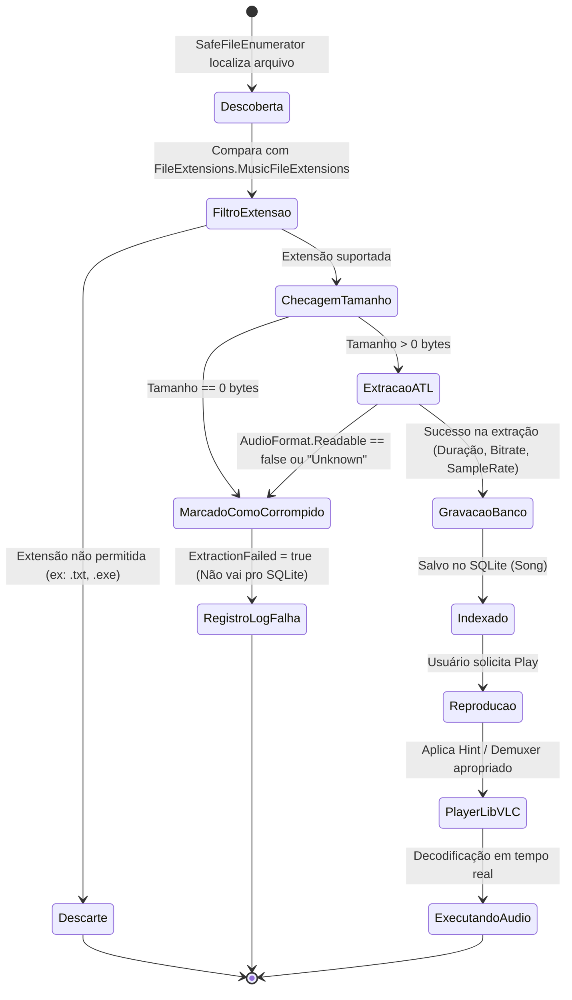

# Data Model: Feature 002 — Multi-Format Audio Library

**Branch**: `002-multi-format-audio-library` | **Date**: 2026-09-20  
**Feature Spec**: [spec.md](spec.md) | **Research**: [research.md](research.md)  

---

## 1. Mapeamento das Entidades

A Feature 002 não cria novas tabelas de banco de dados ou entidades paralelas, respeitando a Regra Constitucional I (*Existing Code Is Truth*). Ela reutiliza integralmente a entidade `Song` existente e o DTO `SongFileMetadata`, complementando com o modelo de consulta em memória `AudioFormatCapability`.

### 1.1 Entidade Existente: `Song` (`Resonance.Core.Models.Song`)
Entidade persistida no banco SQLite local através do Entity Framework Core (`resonance.db`).

| Propriedade | Tipo | Nullable | Descrição / Papel no Multi-Format |
|:---|:---:|:---:|:---|
| `Id` | `Guid` | Não | Chave primária única da faixa |
| `FilePath` | `string` | Não | Caminho absoluto do arquivo (usado para extrair extensão canônica) |
| `DirectoryPath` | `string` | Não | Diretório pai para navegação hierárquica |
| `Title` | `string` | Não | Título da faixa (extraído de tags ou normalizado do filename) |
| `DurationTicks` | `long` | Não | Duração do áudio em ticks do .NET |
| `Bitrate` | `int?` | Sim | Taxa de bits em kbps (ex: 320 para MP3, 900+ para FLAC, 5644 para DSD64) |
| `SampleRate` | `int?` | Sim | Frequência de amostragem em Hz (ex: 44100, 48000, 96000, 192000, 2822400) |
| `Channels` | `int?` | Sim | Número de canais de áudio (1 = Mono, 2 = Estéreo, 6 = 5.1 Surround) |
| `FileCreatedDate` | `DateTime?` | Sim | Timestamp UTC de criação do arquivo |
| `FileModifiedDate` | `DateTime?` | Sim | Timestamp UTC de modificação para detecção de alterações incrementais |

---

### 1.2 DTO de Trânsito: `SongFileMetadata` (`Resonance.Core.Models.SongFileMetadata`)
Objeto de dados em memória preenchido pelo `AtlMetadataService` durante a varredura e repassado para o `LibraryService`.

| Campo | Tipo | Descrição |
|:---|:---:|:---|
| `FilePath` | `string` | Caminho do arquivo inspecionado |
| `Title`, `Album`, `Artists`, `Genres` | `string` / coleções | Metadados musicais extraídos das tags |
| `Duration` | `TimeSpan` | Duração calculada pelo leitor de contêiner de áudio |
| `Bitrate` | `int?` | Taxa de bits média ou constante |
| `SampleRate` | `int?` | Taxa de amostragem em Hertz |
| `Channels` | `int?` | Quantidade de canais de saída |
| `ExtractionFailed` | `bool` | Flag indicando se a leitura do arquivo falhou |
| `ErrorMessage` | `string?` | Código de erro (`"UnsupportedFormat"`, `"CorruptFile"`, `"EmptyFile"`, `"ExtractionTimeout"`, `"FileAccessError"`) |

---

### 1.3 Estrutura de Domínio em Memória: `AudioFormatCapability`
Descritor estático leve para consulta e classificação de formatos.

```csharp
public readonly record struct AudioFormatCapability(
    string Extension,
    string DisplayName,
    AudioCodecCategory Category,
    string? LibVlcHint,
    bool UsesNativeDemuxer,
    bool SupportsTagWriting
);

public enum AudioCodecCategory
{
    Lossy,
    Lossless,
    HiResDsd
}
```

---

## 2. Ciclo de Vida do Arquivo de Áudio Multi-Formato



---

## 3. Regras de Validação & Integridade de Formato

1. **Validação de Entrada de Extensões**:
   - Case-insensitive (`StringComparer.OrdinalIgnoreCase`).
   - Ponto prefixado obrigatório (ex: `".flac"`, não `"flac"`).
2. **Arquivos Vazios (Zero-Byte)**:
   - Arquivos com tamanho 0 bytes são imediatamente identificados e marcados com código `"EmptyFile"`, sem invocar o motor de parsing do ATL.
3. **Cálculo de Duração**:
   - Arquivos com duração `<= 0` e sem streams de áudio detectados pelo ATL são tratados como corrompidos (`"CorruptFile"`).
4. **Isolamento de Erro**:
   - Falhas em um arquivo não afetam a indexação do lote de 100 arquivos nem cancelam a operação global.
