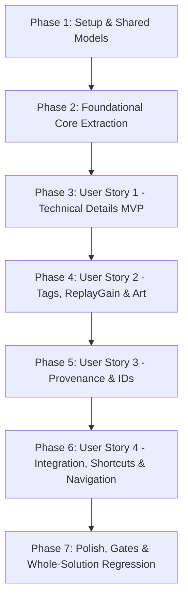

# Tasks: 003 — Track Inspector & Local Metadata

**Feature Branch**: `003-track-inspector-local-metadata`  
**Date**: 2026-09-20  
**Status**: Ready for Implementation  
**Spec Reference**: [spec.md](./spec.md)  
**Implementation Plan**: [plan.md](./plan.md)  
**Data Model**: [data-model.md](./data-model.md)  
**Contracts**: [contracts/track-inspector-contract.md](./contracts/track-inspector-contract.md)  

---

## Constitution Execution Guardrails

```markdown
## META IMUTÁVEL
Problem: O usuário precisa visualizar com clareza tanto as tags musicais quanto os detalhes técnicos reais do arquivo que está tocando ou foi indexado na biblioteca.
Definition of Success: A aplicação mostra metadata local, propriedades técnicas completas, identificadores disponíveis e a origem dos dados para qualquer faixa suportada, com carregamento assíncrono e sem travamentos.
Regra de Ouro: Reutilizar o mecanismo atual de leitura de metadata (AtlMetadataService) antes de adicionar qualquer novo parser. Não duplicar abstrações. Não alterar tags automaticamente sem confirmação.
```

---

## Phase 1: Setup & Shared Data Models

**Purpose**: Criação dos modelos de dados e DTOs de apresentação compartilhados entre Core e UI.

- [X] T001 [P] Create `TrackTechnicalDetails.cs` in `src/Resonance.Core/Models/TrackTechnicalDetails.cs` with properties: `FilePath` (required string), `FileSizeBytes` (long), `FileSizeFormatted` (string), `Duration` (TimeSpan), `ContainerFormat` (string, ex.: "FLAC", "MPEG Audio"), `AudioCodec` (string, ex.: "FLAC", "MP3", "AAC"), `BitrateKbps` (int?), `BitrateMode` (string: "CBR", "VBR", "ABR"), `SampleRateHz` (int?), `BitDepth` (int?, null for lossy), `Channels` (int?), `ChannelsDescription` (string), `FileCreatedDate` (DateTime?), `FileModifiedDate` (DateTime?).
- [X] T002 [P] Create `TrackTagDetails.cs` in `src/Resonance.Core/Models/TrackTagDetails.cs` with properties: `Title` (string), `Artists` (List<string>), `Album` (string?), `AlbumArtists` (List<string>), `TrackNumber` (int?), `TrackCount` (int?), `DiscNumber` (int?), `DiscCount` (int?), `Year` (int?), `Genres` (List<string>), `Composer` (string?), `Conductor` (string?), `Grouping` (string?), `Copyright` (string?), `Comment` (string?), `Isrc` (string?), `Bpm` (double?), `ReplayGainTrackGain` (double?), `ReplayGainTrackPeak` (double?), `ReplayGainAlbumGain` (double?), `ReplayGainAlbumPeak` (double?), `HasLyrics` (bool), `HasSynchronizedLyrics` (bool), `LyricsPreview` (string?).
- [X] T003 [P] Create `TrackArtworkDetails.cs` in `src/Resonance.Core/Models/TrackArtworkDetails.cs` with enum `ArtworkSource` (`None`, `Embedded`, `AdjacentFolder`, `RemoteCache`) and properties: `CoverArtUri` (string?), `MimeType` (string?), `Width` (int?), `Height` (int?), `FileSizeBytes` (long?), `Source` (ArtworkSource), `DimensionsFormatted` (string).
- [X] T004 [P] Create `TrackExternalIds.cs` in `src/Resonance.Core/Models/TrackExternalIds.cs` with properties: `AcoustId` (string?), `MusicBrainzTrackId` (string?), `MusicBrainzReleaseId` (string?), `MusicBrainzArtistId` (string?), `HasAnyExternalId` (bool).
- [X] T005 Create `TrackInspectorViewData.cs` in `src/Resonance.Core/Models/TrackInspectorViewData.cs` consolidating `Technical` (TrackTechnicalDetails), `Tags` (TrackTagDetails), `Artwork` (TrackArtworkDetails), `ExternalIds` (TrackExternalIds), `ProvenanceLabel` (string, default "Arquivo Local"), `CurrentTrackIndex` (int, default 1), `TotalSelectedTracks` (int, default 1), `IsMultiTrackSelection` (bool), `HasPreviousTrack` (bool), `HasNextTrack` (bool).

---

## Phase 2: Foundational (Core Extraction Infrastructure)

**Purpose**: Extensão da interface e do serviço de leitura de metadados existente (`AtlMetadataService`) para suportar a montagem do `TrackInspectorViewData`.

- [X] T006 Extend `IMetadataService` in `src/Resonance.Core/Services/Abstractions/IMetadataService.cs` adding `Task<TrackInspectorViewData> GetTrackInspectorViewDataAsync(string filePath, CancellationToken cancellationToken = default)` and `Task<TrackInspectorViewData> GetTrackInspectorViewDataAsync(Song song, CancellationToken cancellationToken = default)`.
- [X] T007 Implement base extraction scaffolding in `src/Resonance.Core/Services/Implementations/AtlMetadataService.cs` connecting `ATL.Track` to `TrackInspectorViewData` with file existence checks, timeout protection and fallback title generation from file name when tags are missing.

---

## Phase 3: User Story 1 - Inspeção Técnica Profunda e Fidelidade do Formato (Priority: P1) 🎯 MVP

**Goal**: O usuário visualiza com clareza todas as grandezas físicas e de codificação do arquivo de áudio (codec, container, taxa de amostragem, profundidade de bits, canais, bitrate CBR/VBR, duração e tamanho em disco) sem travar a thread de UI.

**Independent Test**: Reproduzir ou selecionar arquivos locais de diversos formatos (FLAC 24/96, MP3 320k, WAV PCM, Opus) e abrir o Inspector; verificar se todas as grandezas físicas e técnicas de codificação são calculadas e renderizadas com fidelidade.

### Implementation for User Story 1

- [X] T008 [P] [US1] Create unit tests in `tests/Resonance.Core.Tests/Services/AtlMetadataServiceTests.cs` verifying extraction of container format, audio codec, CBR vs VBR bitrate modes, sample rates (44.1kHz up to 192kHz), bit depth (16/24/32-bit and null for lossy), channel layouts and formatted file sizes.
- [X] T009 [US1] Implement deep technical property extraction in `src/Resonance.Core/Services/Implementations/AtlMetadataService.cs` mapping `track.AudioFormat.Name`, `track.AudioFormat.ShortName`, `track.BitrateType`, `track.BitDepth`, `track.SampleRate`, and `track.ChannelsArrangement.NbChannels` into `TrackTechnicalDetails`.
- [X] T010 [US1] Create `TrackInspectorViewModel.cs` in `src/Resonance.WinUI/ViewModels/TrackInspectorViewModel.cs` implementing `ITrackInspectorViewModel`, managing `IsOpen`, `IsLoading`, `CurrentData`, and `InspectSongCommand` with asynchronous background loading.
- [X] T011 [US1] Create `TrackInspectorControl.xaml` and `TrackInspectorControl.xaml.cs` in `src/Resonance.WinUI/Controls/TrackInspectorControl.xaml` defining the Technical Details card displaying container format, codec, sample rate, bit depth, channel configuration, bitrate mode, and file size.
- [X] T012 [US1] Register `TrackInspectorViewModel` as a singleton in `src/Resonance.WinUI/App.xaml.cs` inside `ConfigureViewModels(services)`.
- [X] T013 [US1] Validate User Story 1 execution via `dotnet test tests/Resonance.Core.Tests/Resonance.Core.Tests.csproj --filter FullyQualifiedName~AtlMetadataService`.

**Checkpoint**: User Story 1 (MVP) está concluída. As grandezas técnicas são extraídas pelo Core e podem ser renderizadas no controle do Inspector.

---

## Phase 4: User Story 2 - Leitura Completa de Tags Musicais, Letras e Capa de Álbum (Priority: P2)

**Goal**: Exibir metadados musicais completos (título, artistas, álbum, numeração, ano, gênero, compositor, comentários, ISRC), dados de ganho de volume ReplayGain em dB, indicador de letras e visualização/exportação de arte de capa via LightBox modal.

**Independent Test**: Inspecionar faixas com metadados ricos e conferir a exibição correta de cada campo de texto, tags ReplayGain, presença de letras embutidas e ampliação da capa em alta resolução com exportação para disco.

### Implementation for User Story 2

- [X] T014 [P] [US2] Add unit tests in `tests/Resonance.Core.Tests/Services/AtlMetadataServiceTests.cs` for ReplayGain (track/album gain and peak), embedded lyrics presence, and artwork metadata extraction (MIME type, width, height).
- [X] T015 [US2] Implement comprehensive tag, ReplayGain, and embedded picture extraction in `src/Resonance.Core/Services/Implementations/AtlMetadataService.cs` reading from `track.AdditionalFields` and `track.EmbeddedPictures` with safe memory constraints.
- [X] T016 [US2] Create `ArtworkLightBoxDialog.xaml` and `ArtworkLightBoxDialog.xaml.cs` in `src/Resonance.WinUI/Dialogs/ArtworkLightBoxDialog.xaml` implementing modal zoom for full-size cover art and a "Salvar Imagem..." button using `Windows.Storage.Pickers.FileSavePicker`.
- [X] T017 [US2] Update `src/Resonance.WinUI/ViewModels/TrackInspectorViewModel.cs` adding `ExportArtworkCommand`, `IsLightBoxOpen`, and lyrics preview expander state.
- [X] T018 [US2] Update `src/Resonance.WinUI/Controls/TrackInspectorControl.xaml` adding the Musical Tags section, ReplayGain card, lyrics expander, and clickable Cover Art card with dimensions label and LightBox trigger.
- [X] T019 [US2] Validate User Story 2 compilation and view model integrity via `dotnet build Resonance.slnx --configuration Release`.

**Checkpoint**: User Stories 1 e 2 funcionam de forma integrada. O usuário visualiza tanto a ficha técnica quanto a catalogação artística com capa em alta definição.

---

## Phase 5: User Story 3 - Proveniência dos Dados e Identificadores Externos (Priority: P3)

**Goal**: Apresentar crachás explícitos de proveniência de dados (Arquivo Local vs Enriquecimento Externo) e exibir identificadores externos (MusicBrainz IDs, AcoustID) com botão de cópia rápida para o clipboard.

**Independent Test**: Inspecionar faixas locais e faixas enriquecidas com identificadores; verificar que rótulos de proveniência são exibidos e que o botão de cópia armazena o valor exato na área de transferência.

### Implementation for User Story 3

- [X] T020 [P] [US3] Add unit tests in `tests/Resonance.Core.Tests/Services/AtlMetadataServiceTests.cs` validating external IDs extraction (`MUSICBRAINZ_TRACKID`, `MUSICBRAINZ_RELEASEID`, `MUSICBRAINZ_ARTISTID`, `ACOUSTID_ID`) and provenance determination.
- [X] T021 [US3] Implement external IDs extraction and provenance flag assignment in `src/Resonance.Core/Services/Implementations/AtlMetadataService.cs`.
- [X] T022 [US3] Implement `CopyToClipboardCommand` in `src/Resonance.WinUI/ViewModels/TrackInspectorViewModel.cs` using `Windows.ApplicationModel.DataTransfer.DataPackage` and `DataTransfer.Clipboard.SetContent`.
- [X] T023 [US3] Add External IDs card and Provenance Badges in `src/Resonance.WinUI/Controls/TrackInspectorControl.xaml` displaying AcoustID and MusicBrainz IDs with quick copy buttons.

**Checkpoint**: User Stories 1, 2 e 3 estão completas. A integridade dos dados e transparência de origem estão garantidas.

---

## Phase 6: User Story 4 - Acesso Rápido, Teclas de Atalho e Sincronização Dinâmica (Priority: P4)

**Goal**: Integrar o painel retrátil na margem direita de `MainPage.xaml`, acionar via `Alt+Enter`, menu de contexto, botão de reprodução, sincronização automática com a faixa ativa (*Now Playing*) e navegação sequencial em multi-seleção.

**Independent Test**: Selecionar itens na lista de músicas, na visualização de álbuns e na fila, acionando o atalho `Alt+Enter` e conferindo a abertura instantânea e assíncrona do painel; verificar também a sincronização ao trocar de música no player e navegação em seleções múltiplas.

### Implementation for User Story 4

- [X] T024 [US4] Integrate `TrackInspectorControl` into `src/Resonance.WinUI/MainPage.xaml` inside a dedicated right-hand column adjacent to `ContentFrame`, bound to `TrackInspectorVm.IsOpen` with smooth slide/fade animation.
- [X] T025 [US4] Add global `KeyboardAccelerator` (`Key="Enter"`, `Modifiers="Menu"` / Alt) to `src/Resonance.WinUI/MainPage.xaml` connected to `TrackInspectorVm.ToggleInspectorCommand`.
- [X] T026 [US4] Add context menu item "Inspecionar Faixa / Propriedades" to song list DataTemplates across `src/Resonance.WinUI/Pages/LibraryPage.xaml`, `src/Resonance.WinUI/Pages/AlbumViewPage.xaml`, and `src/Resonance.WinUI/Pages/PlaylistSongViewPage.xaml`.
- [X] T027 [US4] Add an Inspector toggle button to secondary controls in `FloatingPlayerContainer` in `src/Resonance.WinUI/MainPage.xaml`.
- [X] T028 [US4] Implement dynamic "Seguir reprodução" subscription in `src/Resonance.WinUI/ViewModels/TrackInspectorViewModel.cs` listening to `IMusicPlaybackService.CurrentSongChanged` when enabled.
- [X] T029 [US4] Implement multi-track pagination controls (`< Anterior` / `Próxima >` with `CurrentTrackIndex` of `TotalSelectedTracks`) in `src/Resonance.WinUI/ViewModels/TrackInspectorViewModel.cs` and the header of `src/Resonance.WinUI/Controls/TrackInspectorControl.xaml`.

**Checkpoint**: Todas as quatro User Stories estão implementadas e conectadas de ponta a ponta na interface do aplicativo.

---

## Phase 7: Polish, Quality Gates & Whole-Solution Regression

**Purpose**: Verificação de casos de borda, execução de cenários do quickstart e validação dos gates obrigatórios da Constituição.

- [ ] T030 Handle edge cases in `src/Resonance.Core/Services/Implementations/AtlMetadataService.cs` and `src/Resonance.WinUI/ViewModels/TrackInspectorViewModel.cs`: graceful handling of raw files without tags, background protected decoding for oversized covers (>20MB), and offline removable media error handling without unhandled exceptions.
- [ ] T031 Execute manual and automated quickstart validation scenarios defined in `specs/003-track-inspector-local-metadata/quickstart.md` (Hi-Res FLAC inspection, ReplayGain, LightBox cover export, multi-selection pagination, and Now Playing follow).
- [ ] T032 Execute whole-solution quality gates: `dotnet restore Resonance.slnx`, `dotnet build Resonance.slnx --configuration Release --warnaserror`, and `dotnet test Resonance.slnx --configuration Release --no-build`.

---

## Dependencies & Execution Order

### Phase Dependencies



### User Story Dependencies

- **User Story 1 (P1 - MVP)**: Depende de Phase 1 e Phase 2. Pode ser implementada e testada de forma 100% independente entregando a funcionalidade essencial de inspeção técnica.
- **User Story 2 (P2)**: Depende de Phase 2 e estende os modelos de US1 com tags musicais, ReplayGain e capa.
- **User Story 3 (P3)**: Depende de Phase 2 e adiciona crachás de procedência e identificadores externos.
- **User Story 4 (P4)**: Conecta o controle na interface de `MainPage.xaml`, atalhos de teclado e paginação em lote.
- **Polish (Phase 7)**: Executa os gates da Constituição após a conclusão de todas as histórias.

### Parallel Opportunities

- Modelos de dados em Phase 1 (`T001`, `T002`, `T003`, `T004`) podem ser criados em paralelo por estarem em arquivos separados.
- Testes unitários de cada história (`T008`, `T014`, `T020`) podem ser escritos em paralelo com o desenvolvimento de ViewModels e controles XAML correspondentes.
- O diálogo `ArtworkLightBoxDialog` (`T016`) pode ser desenvolvido em paralelo com as alterações em `AtlMetadataService` (`T015`).

---

## Implementation Strategy: MVP First

1. **Etapa 1 (Fundação & MVP)**: Executar Phase 1, Phase 2 e Phase 3. Validar extração técnica e exibição básica (MVP entregue e demonstrável).
2. **Etapa 2 (Enriquecimento Artístico)**: Executar Phase 4 e Phase 5. Adicionar tags completas, ReplayGain, LightBox de capa e proveniência de dados.
3. **Etapa 3 (Experiência do Usuário & Ergonomia)**: Executar Phase 6. Integrar painel retrátil em `MainPage.xaml`, atalho `Alt+Enter` e paginação sequencial.
4. **Etapa 4 (Gates & Regressão Final)**: Executar Phase 7. Compilação estrita em Release e validação de toda a suíte de testes.
