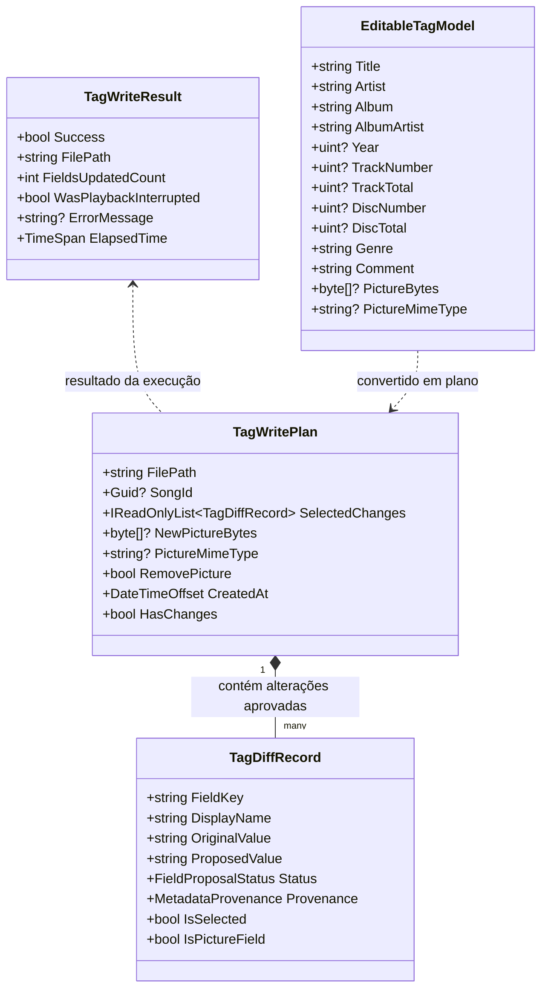
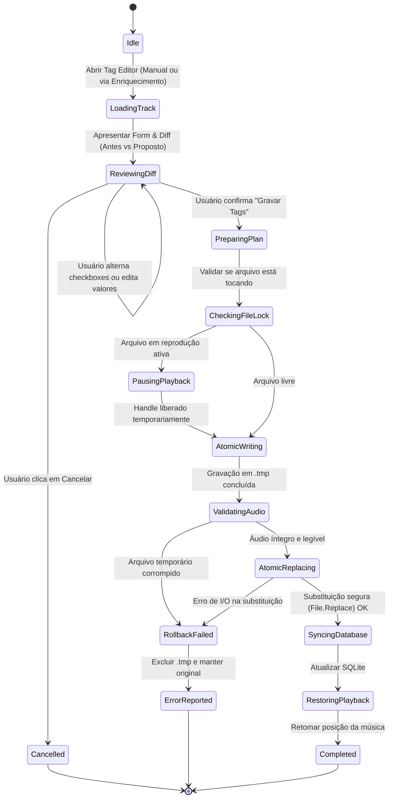

# Data Model: 006 — Metadata Review, Tag Editor & File Update

**Branch**: `006-metadata-review-tag-editor`  
**Date**: 2026-09-22  
**Status**: Completed  
**Spec Reference**: [spec.md](./spec.md) | [research.md](./research.md)

---

## 1. Visão Geral do Modelo de Domínio

O modelo de dados da Feature 006 atua como a ponte segura entre a representação em memória de metadados (incluindo as propostas da Feature 005), os formulários de edição do usuário e a escrita atômica no container físico do arquivo de áudio.

---

## 2. Entidades Principais

### 2.1. `TagDiffRecord`
Representa uma linha individual de comparação entre o valor original persistido no arquivo e o valor proposto (seja por enriquecimento online ou edição do usuário).

| Campo | Tipo | Descrição | Regras de Validação |
|:---|:---|:---|:---|
| `FieldKey` | `string` | Identificador canônico do campo (ex.: `Title`, `Year`, `CoverArt`) | Não nulo, obrigatório |
| `DisplayName` | `string` | Rótulo amigável para exibição na UI (ex.: "Título", "Ano de Lançamento") | Não nulo |
| `OriginalValue` | `string?` | Valor atual lido do arquivo físico ou do banco | Pode ser nulo/vazio |
| `ProposedValue` | `string?` | Valor sugerido pelo provider ou digitado pelo usuário | Pode ser nulo/vazio |
| `Status` | `FieldProposalStatus` | `Unchanged`, `Updated`, `NewValue`, `Conflict` | Enum reutilizado da Feature 005 |
| `Provenance` | `MetadataProvenance` | `LocalTag`, `MusicBrainz`, `CoverArtArchive`, `UserOverride` | Enum reutilizado da Feature 005 |
| `IsSelected` | `bool` | Flag observável (com suporte a INotifyPropertyChanged) que indica se o campo será gravado | Padrão `true` se houver alteração |
| `IsPictureField` | `bool` | Indica se o registro trata de imagem de capa em vez de texto | Booleano |

---

### 2.2. `TagWritePlan`
Objeto imutável contendo o plano de gravação validado e aprovado pelo usuário para aplicação atômica em disco.

| Campo | Tipo | Descrição |
|:---|:---|:---|
| `FilePath` | `string` | Caminho físico absoluto do arquivo de áudio a ser atualizado |
| `SongId` | `Guid?` | Identificador da faixa na biblioteca local (SQLite), se indexada |
| `SelectedChanges` | `IReadOnlyList<TagDiffRecord>` | Coleção de campos com `IsSelected == true` e `Status != Unchanged` |
| `NewPictureBytes` | `byte[]?` | Bytes brutos da nova imagem frontal a ser embutida (se aprovada) |
| `PictureMimeType` | `string?` | Tipo MIME da imagem (ex.: `image/jpeg`, `image/png`) |
| `RemovePicture` | `bool` | Flag para remover imagem embutida existente sem substituir |
| `CreatedAt` | `DateTimeOffset` | Timestamp de geração do plano |
| `HasChanges` | `bool` | Propriedade calculada (`SelectedChanges.Any() || NewPictureBytes != null || RemovePicture`) |

---

### 2.3. `TagWriteResult`
Objeto de retorno da rotina de gravação atômica contendo telemetria e status.

| Campo | Tipo | Descrição |
|:---|:---|:---|
| `Success` | `bool` | `true` se o arquivo foi gravado, verificado e substituído com sucesso |
| `FilePath` | `string` | Caminho do arquivo processado |
| `FieldsUpdatedCount` | `int` | Quantidade de campos alterados com sucesso |
| `WasPlaybackInterrupted` | `bool` | Indica se o playback da faixa precisou ser coordenado/restaurado |
| `ErrorMessage` | `string?` | Mensagem de erro caso a operação tenha falhado |
| `ElapsedTime` | `TimeSpan` | Tempo decorrido na operação atômica de escrita e verificação |

---

### 2.4. `EditableTagModel`
Modelo de apoio para o `TagEditorDialog` em WinUI, permitindo two-way binding nos campos de formulário antes da geração do `TagWritePlan`.

| Campo | Tipo | Mapeamento ATL.Track |
|:---|:---|:---|
| `Title` | `string?` | `track.Title` |
| `Artist` | `string?` | `track.Artist` |
| `Album` | `string?` | `track.Album` |
| `AlbumArtist` | `string?` | `track.AlbumArtist` |
| `Year` | `uint?` | `track.Year` |
| `TrackNumber` | `uint?` | `track.TrackNumber` |
| `TrackTotal` | `uint?` | `track.TrackTotal` |
| `DiscNumber` | `uint?` | `track.DiscNumber` |
| `DiscTotal` | `uint?` | `track.DiscTotal` |
| `Genre` | `string?` | `track.Genre` |
| `Comment` | `string?` | `track.Comment` |
| `PictureBytes` | `byte[]?` | `track.EmbeddedPictures` (PictureInfo Front Cover) |

---

## 3. Máquina de Estados e Ciclo de Vida da Gravação

