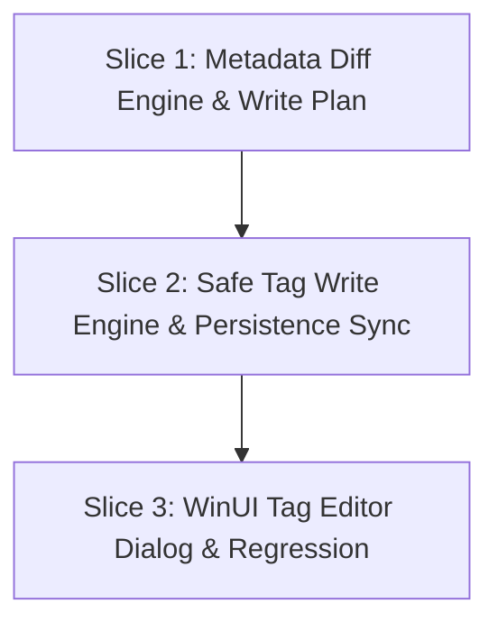

# Tasks: 006 — Metadata Review, Tag Editor & File Update

**Feature Branch**: `006-metadata-review-tag-editor`  
**Date**: 2026-09-22  
**Status**: Ready for Implementation  
**Spec Reference**: [spec.md](./spec.md)  
**Implementation Plan**: [plan.md](./plan.md)  
**Data Model**: [data-model.md](./data-model.md)  
**Contracts**: [contracts/](./contracts/)  
**Quickstart Guide**: [quickstart.md](./quickstart.md)  
**Quality Checklist**: [checklists/quality.md](./checklists/quality.md)  

---

## Constitution Execution Guardrails

- **Princípio I (Fonte da Verdade)**: Reutilização estrita da biblioteca ATL.NET (`ATL.Track`), `AtlMetadataService`, `ILibraryWriter`, `IMusicPlaybackService` e dos modelos de status/proveniência da Feature 005. Proibida a introdução de bibliotecas redundantes de áudio (ex.: TagLib#).
- **Princípio II (Fatias Verticais)**: A implementação está organizada estritamente em **3 Fatias Verticais ponta a ponta**. Cada fatia repete o bloco META IMUTÁVEL e encerra com validação local de compilação e testes.
- **Princípio III (Validação da Solution)**: A fatia final valida a solution inteira com `dotnet restore Resonance.slnx`, `dotnet build Resonance.slnx --configuration Release -p:Platform=x64 --warnaserror` e `dotnet test Resonance.slnx --configuration Release --no-build`.
- **Princípio IV (Local-First & Integridade de Arquivo)**: A gravação de tags é 100% atômica, offline e segura contra corrupção. Em caso de falha de hardware, falta de espaço em disco ou exceção de I/O, o arquivo original permanece intacto.
- **Princípio VII (Fronteiras e Fluxo de Metadados)**: O sistema respeita rigorosamente o ciclo constitucional: `Review -> Diff -> Explicit confirmation -> Apply`. Nenhuma gravação automática em disco ocorre por resultado de API (Regra de Ouro / SC-003).

---

## Slice 1: Metadata Diff Engine & Write Plan (Core)

```markdown
## META IMUTÁVEL
Problem: O usuário precisa comparar o estado atual das tags físicas com sugestões online (Feature 005) ou edições manuais e ligar/desligar cada campo individualmente com transparência.
Definition of Success: O serviço TagDiffService processa as diferenças campo a campo (texto, números e capa), permite seleção individual via IsSelected, classifica status (Unchanged, Updated, NewValue, Conflict) e gera um TagWritePlan imutável validado pronto para gravação física, com 100% dos testes de unidade passando.
```

- [X] T001 [P] [Slice1] Create `TagDiffRecord.cs` in `src/Resonance.Core/Models/TagDiffRecord.cs` with properties: `FieldKey` (string), `DisplayName` (string), `OriginalValue` (string?), `ProposedValue` (string?), `Status` (FieldProposalStatus), `Provenance` (MetadataProvenance), `IsPictureField` (bool), `IsSelected` (bool observável com CommunityToolkit.Mvvm), e propriedade computada `HasChanged`.
- [X] T002 [P] [Slice1] Create `TagWritePlan.cs` in `src/Resonance.Core/Models/TagWritePlan.cs` with properties: `FilePath` (string), `SongId` (Guid?), `SelectedChanges` (IReadOnlyList<TagDiffRecord>), `NewPictureBytes` (byte[]?), `PictureMimeType` (string?), `RemovePicture` (bool), `CreatedAt` (DateTimeOffset), e propriedade computada `HasChanges`.
- [X] T003 [P] [Slice1] Create `TagWriteResult.cs` in `src/Resonance.Core/Models/TagWriteResult.cs` with properties: `Success` (bool), `FilePath` (string), `FieldsUpdatedCount` (int), `WasPlaybackInterrupted` (bool), `ErrorMessage` (string?), `ElapsedTime` (TimeSpan), e métodos estáticos de fábrica `Failed` e `Succeeded`.
- [X] T004 [P] [Slice1] Create `EditableTagModel.cs` in `src/Resonance.Core/Models/EditableTagModel.cs` herdando de `ObservableObject` com propriedades observáveis: `Title`, `Artist`, `Album`, `AlbumArtist`, `Year`, `TrackNumber`, `TrackTotal`, `DiscNumber`, `DiscTotal`, `Genre`, `Comment`, `PictureBytes`, e `PictureMimeType`.
- [X] T005 [P] [Slice1] Create `ITagDiffService.cs` in `src/Resonance.Core/Services/Abstractions/ITagDiffService.cs` declarando `IReadOnlyList<TagDiffRecord> GenerateDiff(string filePath, TrackAudioTags currentTags, EnrichmentProposal proposal)`, `IReadOnlyList<TagDiffRecord> GenerateDiff(string filePath, TrackAudioTags originalTags, EditableTagModel editedModel)`, e `TagWritePlan CreateWritePlan(string filePath, IEnumerable<TagDiffRecord> diffRecords, byte[]? newPictureBytes = null, string? pictureMimeType = null, Guid? songId = null)`.
- [X] T006 [P] [Slice1] Create unit tests in `tests/Resonance.Core.Tests/Services/TagDiffServiceTests.cs` testando a matriz completa de diff: campos idênticos (`Unchanged`), campos com novos valores (`NewValue`), campos atualizados (`Updated`), conversão direta a partir de `EnrichmentProposal`, seleção de capa embutida, e geração do `TagWritePlan` filtrando apenas campos onde `IsSelected == true`.
- [X] T007 [Slice1] Implement `TagDiffService.cs` in `src/Resonance.Core/Services/Implementations/TagDiffService.cs` implementando as comparações textuais normalizadas, números de faixa/disco, tratamento de gêneros, identificação de capas e montagem de `TagWritePlan`.
- [X] T008 [Slice1] Register `ITagDiffService` singleton in `src/Resonance.WinUI/App.xaml.cs`.
- [X] T009 [Slice1] Gate Slice 1: Validate build and test execution of the diff engine:
  ```powershell
  dotnet test tests/Resonance.Core.Tests --filter FullyQualifiedName~TagDiffServiceTests
  ```

---

## Slice 2: Safe Tag Write Engine & Persistence Sync (Core & Infra)

```markdown
## META IMUTÁVEL
Problem: Gravar alterações no arquivo físico sem risco de corrupção em caso de queda de energia ou lock de processo, e manter a biblioteca sincronizada.
Definition of Success: O serviço SafeTagWriterService executa o pipeline em 4 etapas: gravação em .tmp no mesmo diretório, escrita via ATL.Track, validação pós-escrita de integridade de áudio, desativação de Read-Only, substituição atômica via File.Replace, coordenação com IMusicPlaybackService para pausa/retomada suave se a música estiver tocando, e atualização imediata do SQLite em < 50ms, garantindo 100% de preservação do arquivo original em caso de erro.
```

- [X] T010 [P] [Slice2] Create `ITagWriterService.cs` in `src/Resonance.Core/Services/Abstractions/ITagWriterService.cs` declarando `Task<TagWriteResult> ApplyWritePlanAsync(TagWritePlan plan, CancellationToken cancellationToken = default)` e `Task<bool> ValidateAudioFileIntegrityAsync(string filePath, CancellationToken cancellationToken = default)`.
- [X] T011 [P] [Slice2] Create unit and integration tests in `tests/Resonance.Core.Tests/Services/SafeTagWriterServiceTests.cs` cobrindo:
  - Gravação round-trip de tags em arquivos de teste MP3 e FLAC.
  - Gravação de imagem de capa embutida (PictureInfo Front Cover).
  - Simulação de falha de gravação: verificação de que o arquivo temporário `.tmp` é excluído e o original permanece 100% inalterado.
  - Tratamento de arquivo marcado como Somente-Leitura (*Read-Only*): remoção temporária da flag e sucesso da substituição atômica.
  - Coordenação de playback: verificação de que se o arquivo estiver em reprodução ativa, o stream é pausado e restaurado no mesmo timestamp.
  - Sincronização pós-escrita: verificação de chamada para atualização de metadados na persistência do banco de dados.
- [X] T012 [Slice2] Implement `SafeTagWriterService.cs` in `src/Resonance.Core/Services/Implementations/SafeTagWriterService.cs` contendo:
  - Cópia do arquivo original para `<nome>.tmp.<guid>` no mesmo diretório para garantir atomicidade no mesmo volume de disco.
  - Abertura do temporário e gravação das tags selecionadas no `TagWritePlan` via `ATL.Track.Save()`.
  - Embutimento de bytes de capa via `ATL.PictureInfo.fromBinaryData(...)` ou remoção quando solicitado.
  - Validação pós-escrita via `ValidateAudioFileIntegrityAsync` (releitura do temporário certificando que `DurationMs > 0` e headers válidos).
  - Remoção temporária da flag `FileAttributes.ReadOnly` caso presente no arquivo original.
  - Coordenação de lock com `IMusicPlaybackService`: se `CurrentTrack?.FilePath == plan.FilePath`, pausar stream, executar a substituição atômica e restaurar posição com `SeekAsync`.
  - Substituição atômica com `File.Replace(tempPath, originalPath, backupPath, ignoreMetadataStoreErrors: true)` com deleção imediata do backup pós-sucesso.
  - Rollback seguro: em qualquer exceção, excluir arquivos temporários e preservar o original.
  - Sincronização de catálogo: reler com `_metadataService.ExtractMetadataAsync` e atualizar SQLite via `_libraryWriter.UpdateSongAsync`.
- [X] T013 [Slice2] Register `ITagWriterService` singleton in `src/Resonance.WinUI/App.xaml.cs`.
- [X] T014 [Slice2] Gate Slice 2: Validate build and test execution of the safe tag writer engine:
  ```powershell
  dotnet test tests/Resonance.Core.Tests --filter FullyQualifiedName~SafeTagWriterServiceTests
  ```

---

## Slice 3: WinUI Tag Editor Dialog & Regression (UI & Integração Final)

```markdown
## META IMUTÁVEL
Problem: O usuário precisa de uma interface rica, moderna e clara para revisar o diff de propostas online ou editar campos manualmente antes de salvar.
Definition of Success: Diálogo unificado TagEditorDialog em WinUI apresenta formulário completo com visão comparativa Antes vs Sugerido quando originado da Feature 005, checkboxes campo a campo, preview de capa, botão "Gravar Alterações" com confirmação explícita, integrado ao Track Inspector e ao menu de contexto da biblioteca, com a Solution inteira compilando e 100% dos testes passando.
```

- [ ] T015 [P] [Slice3] Create `TagEditorViewModel.cs` in `src/Resonance.WinUI/ViewModels/TagEditorViewModel.cs` herdando de `ObservableObject` com:
  - Propriedades observáveis para a faixa atual (`Song`, `FilePath`), modelo editável (`EditableTagModel`), coleção de diferenças (`ObservableCollection<TagDiffRecord>`), flag `IsReviewMode` (true quando aberto via proposta online, false quando manual), estado `IsSaving`, mensagem de status e capa sugerida/atual.
  - Comandos: `ToggleSelectAllCommand`, `SaveTagsCommand` (que valida os campos, gera o `TagWritePlan` via `ITagDiffService`, executa via `ITagWriterService` e fecha o diálogo com sucesso), e `CancelCommand`.
- [ ] T016 [P] [Slice3] Create `TagEditorDialog.xaml` and `TagEditorDialog.xaml.cs` in `src/Resonance.WinUI/Dialogs/TagEditorDialog.xaml` e `.cs`:
  - Implementado como `ContentDialog` com `XamlRoot` vinculado à janela principal.
  - Modo Revisão de Diff: visualização comparativa em colunas (Check de inclusão, Nome do Campo, Valor Atual, Sugestão Proposta, Badge de Status).
  - Modo Edição Manual: formulário direto com caixas de texto para Título, Artistas, Álbum, Artista do Álbum, Ano, Faixa/Total, Disco/Total, Gênero e Comentário.
  - Card de pré-visualização de capa de álbum (Capa atual vs Capa proposta) com botão de exclusão ou substituição.
  - Botões primário ("Gravar Alterações") e secundário ("Cancelar") e barra de progresso durante gravação física.
- [ ] T017 [Slice3] Update `TrackInspectorViewModel.cs` in `src/Resonance.WinUI/ViewModels/TrackInspectorViewModel.cs`:
  - Injetar `IServiceProvider` ou fábrica de diálogos.
  - Implementar o corpo do comando `AdvanceToTagReviewAsync` para instanciar e exibir o `TagEditorDialog` passando o `CurrentProposal` ativo.
  - Após a gravação bem-sucedida, atualizar os dados do inspector chamando `LoadTrackDataAsync`.
- [ ] T018 [Slice3] Add "Editar Tags" context menu command in `src/Resonance.WinUI/ViewModels/SongListViewModelBase.cs` e vincular nas views (`LibraryPage.xaml`, `AlbumViewPage.xaml`, `PlaylistSongViewPage.xaml`), permitindo abrir o `TagEditorDialog` em modo de edição manual para qualquer faixa da lista.
- [ ] T019 [P] [Slice3] Create ViewModel and dialog unit tests in `tests/Resonance.Core.Tests/ViewModels/TagEditorViewModelTests.cs` validando comandos de seleção, alternância entre modo de diff e modo manual, e chamada do plano de escrita.
- [ ] T020 [Slice3] Execute quickstart validation scenarios descritos em `specs/006-metadata-review-tag-editor/quickstart.md` (Cenário 1: Revisão online, Cenário 2: Edição manual, Cenário 3: Resiliência em playback, Cenário 4: Arquivo Read-Only).
- [ ] T021 [Slice3] Final Solution Gate: Validate whole-solution build and test gates in Release mode:
  ```powershell
  dotnet restore Resonance.slnx
  dotnet build Resonance.slnx --configuration Release -p:Platform=x64 --warnaserror
  dotnet test Resonance.slnx --configuration Release --no-build
  ```

---

## Dependencies & Execution Order

### Vertical Slice Dependencies



- **Slice 1 (Diff & Write Plan)**: Inicia imediatamente. Produz os modelos (`TagDiffRecord`, `TagWritePlan`, `TagWriteResult`), o serviço `TagDiffService` e a suite de testes de matriz de diff.
- **Slice 2 (Safe Tag Write Engine)**: Depende dos modelos e planos da Slice 1. Implementa a gravação atômica em 4 fases com ATL.Track, substituição segura, lock handling de playback, tratamento de *Read-Only* e sincronização SQLite.
- **Slice 3 (WinUI Tag Editor Dialog & Regressão)**: Depende das Slices 1 e 2. Constrói o `TagEditorDialog`, `TagEditorViewModel`, integra com o Track Inspector e menus de contexto, finalizando com a validação completa da Solution.

---

## Parallel Execution Opportunities

- **Na Slice 1**: `T001`, `T002`, `T003` e `T004` (Modelos) podem ser criados em paralelo; `T006` (Testes) pode ser escrito em paralelo à definição de contratos.
- **Na Slice 2**: `T010` (Contrato) e `T011` (Testes de integração) podem ser desenvolvidos em paralelo antes da implementação do motor em `T012`.
- **Na Slice 3**: `T015` (ViewModel) e `T016` (XAML do Diálogo) podem ser implementados em paralelo; `T019` (Testes de ViewModel) pode rodar em paralelo.

---

## Implementation Strategy (MVP)

1. **MVP (Fatias 1 e 2)**: Garante a integridade absoluta dos dados no disco, a lógica de cálculo de diff e a gravação atômica segura testada e validada.
2. **Entrega Completa (Fatia 3)**: Adiciona a experiência visual do `TagEditorDialog`, conectando tanto a revisão de enriquecimento do MusicBrainz quanto a edição manual no Resonance Player.
